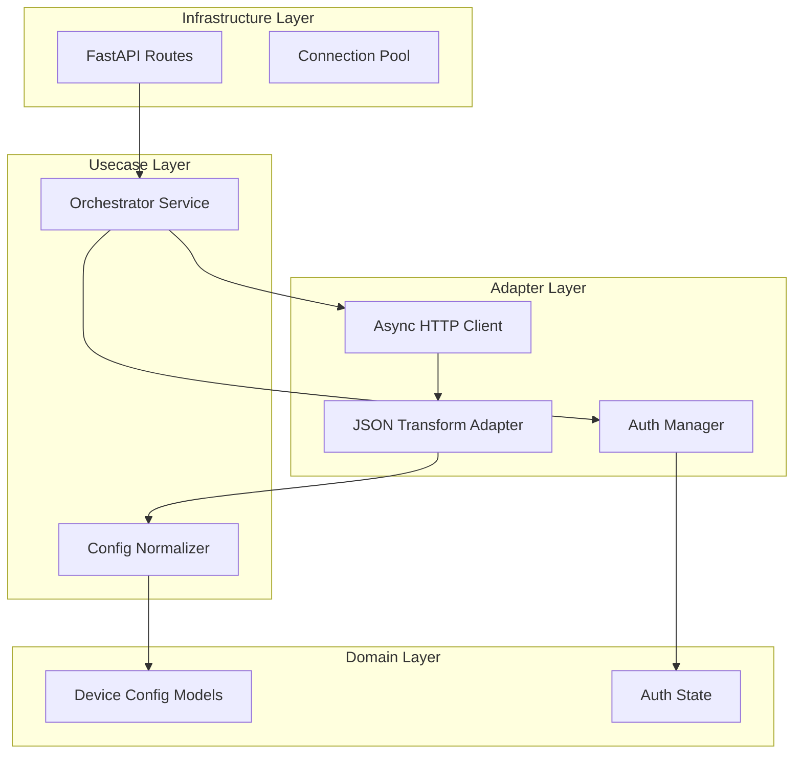

# Design Document: API Client Orchestrator


## Overview


The API Client Orchestrator design focuses on a high-concurrency, asynchronous architecture for interacting with disparate Network Management Systems (NMS). The strategy centers on 'Batch-Based Concurrency Control', where thousands of device configuration requests are orchestrated through a semaphore-limited async loop. This ensures high throughput for compliance audits (Requirement 2) while maintaining the low-latency response needed for pre-flight fetches (Requirement 4).

The architecture separates the concerns of authentication, transport, and data transformation. A centralized Multi-Tenant Auth Manager handles the complexities of token lifecycles and secure storage (Requirement 1), allowing the fetch logic to remain stateless. A dedicated Normalization engine (Requirement 3) bridges the gap between complex, proprietary NMS JSON payloads and the clean, diffable text required by auditors. We are moving away from sequential, blocking I/O to a fully non-blocking, event-driven model using Python's asyncio and httpx.


## Architecture





## Components and Interfaces


### 1. Fleet Orchestrator (`usecases`)


**Path:** `src/usecases/orchestrator.py`

| Responsibility | Description |
|---|---|
| Coordinate parallel fetching of configurations across multiple NMS endpoints | |
| Manage concurrency limits to prevent NMS service degradation | |
| Aggregate results into a unified stream for the caller | |


```python
class ConfigOrchestrator:
    async def fetch_fleet_configs(
        self, 
        device_ids: List[str], 
        batch_size: int = 50
    ) -> AsyncIterable[NormalizedConfig]:
        semaphore = asyncio.Semaphore(batch_size)
        tasks = [self._fetch_single(d, semaphore) for d in device_ids]
        for task in asyncio.as_completed(tasks):
            yield await task
```


### 2. Multi-Tenant Auth Manager (`adapters`)


**Path:** `src/adapters/auth_manager.py`

| Responsibility | Description |
|---|---|
| Securely store and retrieve per-tenant credentials | |
| Handle automatic token refresh and lifecycle management | |
| Encapsulate NMS-specific authentication handshakes | |


```python
class MultiTenantAuthManager:
    async def get_session(self, tenant_id: str) -> AuthenticatedSession:
        if self._needs_refresh(tenant_id):
            await self._reauthenticate(tenant_id)
        return self._sessions[tenant_id]
```


### 3. Config Normalizer (`usecases`)


**Path:** `src/usecases/normalizer.py`

| Responsibility | Description |
|---|---|
| Extract raw config text from complex NMS JSON responses | |
| Strip volatile metadata to enable accurate diffing | |
| Support multiple NMS vendor response formats via transformation strategies | |


```python
class ConfigNormalizer:
    def normalize(self, raw_payload: dict, platform_type: str) -> str:
        parser = self._get_parser(platform_type)
        raw_text = parser.extract_text(raw_payload)
        return self._strip_volatile_lines(raw_text)
```


## Data Models


No new data models are introduced unless specified in the component descriptions above.


## Correctness Properties


*A property is a characteristic or behavior that should hold true across all valid executions of a system — essentially, a formal statement about what the system should do.*


### Property F0a-P1: Concurrency Bound


*For any fetch_fleet_configs operation, the maximum number of concurrent active HTTP connections shall never exceed the defined BATCH_SIZE.*

**Validates: Requirements 2, 4**


### Property F0a-P2: Self-Healing Authentication


*For any API request following a 401 Unauthorized response, the AuthManager must attempt exactly one credential refresh before retrying or failing.*

**Validates: Requirements 1**


### Property F0a-P3: Normalization Integrity


*For any normalized configuration output, the content must be free of platform-specific JSON envelopes and metadata keys.*

**Validates: Requirements 3**


## Error Handling


| Scenario | Handling |
|---|---|
| Individual NMS Device Timeout | The Orchestrator captures the exception, logs it with the device ID, and continues processing the remaining fleet to ensure the audit completes. |
| NMS Credential Expiration/Rotation | The AuthManager enters a 'Locked' state for that tenant; all pending fetches for that tenant fail immediately with an AuthException to prevent account lockout. |
| Malformed/Unexpected JSON Response Structure | The Normalizer returns the raw response labeled as 'UNPARSABLE' to allow the auditor to see the raw data while marking the failure. |


## Testing Strategy


The testing strategy will focus on high-concurrency scenarios and edge-case authentication failures. 

1. **Regression Testing**: Existing single-device fetch tests will be wrapped in the new Orchestrator to ensure backward compatibility with unified config models.
2. **CI Verification**: The CI pipeline will execute `pytest-asyncio` suites. A specific 'stress-test' job will use a mock NMS server to simulate 1,000 devices responding with varying latencies to verify the batching logic.
3. **Property-Based Testing**: Using Hypothesis and 'hypothesis-auto-pytest', we will generate arbitrary JSON structures to test the Config Normalizer. The invariant tested will be: 'the output must always be a UTF-8 string regardless of input structure'. 
4. **Configuration**: Testing will use 'pytest-asyncio' with 'mode=auto'. Concurrency benchmarks will be tagged with '@pytest.mark.performance' and run against a local containerized MockNiti server.
