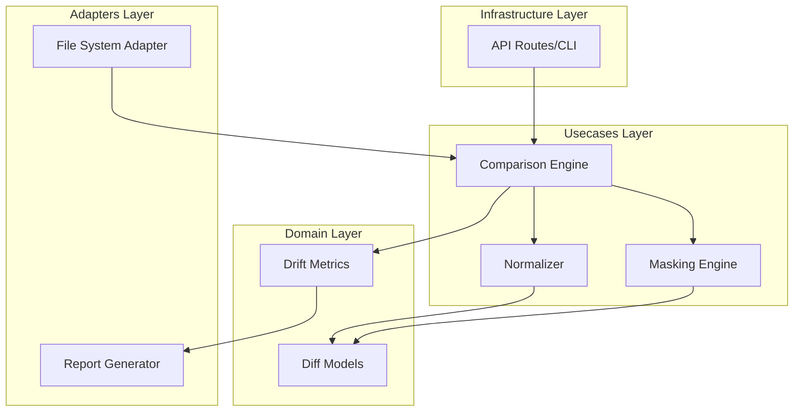

# Design Document: Comparison Engine

## Overview

The Comparison Engine is designed as a modular pipeline that transforms raw configuration data into actionable compliance metrics. The strategy focuses on 'Pre-computation Normalization'—meaning configs are cleaned and masked before they ever reach the diffing algorithm. This ensures the core diffing logic remains simple and standard (Myers algorithm), while the complexity of vendor-specific quirks and dynamic data is handled by the Normalizer and Masking Engine.

Incremental implementation will start with the line-by-line diffing core, followed by the normalization logic to handle whitespace. The masking engine and drift metrics will be added in the final phase. Existing file-loading infrastructure remains unchanged; this feature sits entirely within the usecases and domain layers, interacting via provided config strings.

## Architecture

## Data Models

No new data models are introduced unless specified in the component descriptions above.

## Testing Strategy

Testing will follow a 'Shift-Left' approach with a heavy emphasis on Property-Based Testing (PBT). We will use the Hypothesis library to generate arbitrary strings with varying whitespace to ensure our Normalizer is truly idempotent and invariant to formatting.

Regression testing will involve a 'Golden Config Suite'—a collection of real-world device configurations and their expected diff reports. 

CI Verification:
- `pytest tests/unit/comparison_engine`: Runs unit tests for core logic.
- `pytest tests/property/test_normalization.py`: Runs Hypothesis tests with 1000 iterations for whitespace/masking invariants.

Testing Configuration:
- Library: Hypothesis (for PBT)
- Iterations: 1000 per property
- Tag Format: @compliance-engine-core
