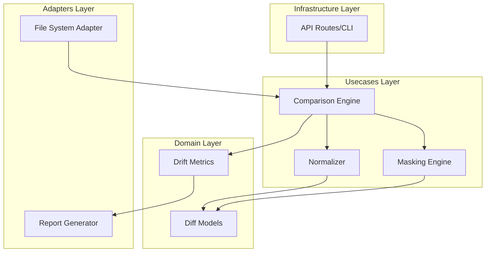

# Design Document: Comparison Engine


## Overview


The Comparison Engine is designed as a modular pipeline that transforms raw configuration data into actionable compliance metrics. The strategy focuses on 'Pre-computation Normalization'—meaning configs are cleaned and masked before they ever reach the diffing algorithm. This ensures the core diffing logic remains simple and standard (Myers algorithm), while the complexity of vendor-specific quirks and dynamic data is handled by the Normalizer and Masking Engine.

Incremental implementation will start with the line-by-line diffing core, followed by the normalization logic to handle whitespace. The masking engine and drift metrics will be added in the final phase. Existing file-loading infrastructure remains unchanged; this feature sits entirely within the usecases and domain layers, interacting via provided config strings.


## Architecture





## Components and Interfaces


### 1. Comparison Orchestrator (`usecases`)


**Path:** `src/usecases/comparison_engine.py`

| Responsibility | Description |
|---|---|
| Coordinate the normalization and masking pipeline | |
| Execute line-by-line diffing algorithm | |
| Calculate drift metrics from diff output | |
| Generate structured ComparisonReport objects | |


```python
class IComparisonEngine(Protocol):
    def compare(
        self, 
        running_cfg: str, 
        golden_cfg: str, 
        masks: List[str] = []
    ) -> ComparisonReport:
        ...
```


### 2. Pre-processor Engine (`usecases`)


**Path:** `src/usecases/normalizer.py`

| Responsibility | Description |
|---|---|
| Strip leading/trailing whitespace from lines | |
| Standardize CRLF/LF line endings | |
| Apply regex patterns to hide variable data | |
| Ensure idempotent text transformation | |


```python
class TextProcessor:
    def normalize_whitespace(self, text: str) -> str:
        # Removes trailing spaces and standardizes line endings
        pass

    def apply_masks(self, text: str, patterns: List[str]) -> str:
        # Replaces regex matches with standard tokens
        pass
```


### 3. Drift Metrics Calculator (`domain`)


**Path:** `src/domain/metrics.py`

| Responsibility | Description |
|---|---|
| Quantify differences into numerical metrics | |
| Calculate fleet-wide health percentages | |
| Provide statistical summaries of config drift | |


```python
@dataclass(frozen=True)
class DriftMetrics:
    total_lines: int
    added_lines: int
    deleted_lines: int
    changed_lines: int

    @property
    def health_score(self) -> float:
        return (1 - (self.changed_lines / self.total_lines)) * 100
```


## Data Models


No new data models are introduced unless specified in the component descriptions above.


## Correctness Properties


*A property is a characteristic or behavior that should hold true across all valid executions of a system — essentially, a formal statement about what the system should do.*


### Property F0b-P1: Whitespace Invariance


*For any two configuration strings that differ only by trailing whitespace or line endings, the health_score must be 100.0.*

**Validates: Requirements 4.1**


### Property F0b-P2: Masking Integrity


*For any regex mask provided, the health_score must remain unchanged regardless of the value contained within the masked field, provided the surrounding context is identical.*

**Validates: Requirements 2.1**


### Property F0b-P3: Metrics Boundedness


*For any comparison, the Health Score must be a value between 0 and 100, where 100 indicates an exact match after normalization/masking.*

**Validates: Requirements 3.1**


## Error Handling


| Scenario | Handling |
|---|---|
| Invalid Regular Expression Mask Provided | The Masking Engine validates regex syntax before execution; invalid patterns are logged, and the comparison proceeds without that specific mask to prevent total failure. |
| Non-UTF8 Configuration File Encodings | The engine detects the encoding and converts it to UTF-8 before processing; if conversion fails, an UnsupportedEncodingError is raised. |


## Testing Strategy


Testing will follow a 'Shift-Left' approach with a heavy emphasis on Property-Based Testing (PBT). We will use the Hypothesis library to generate arbitrary strings with varying whitespace to ensure our Normalizer is truly idempotent and invariant to formatting.

Regression testing will involve a 'Golden Config Suite'—a collection of real-world device configurations and their expected diff reports. 

CI Verification:
- `pytest tests/unit/comparison_engine`: Runs unit tests for core logic.
- `pytest tests/property/test_normalization.py`: Runs Hypothesis tests with 1000 iterations for whitespace/masking invariants.

Testing Configuration:
- Library: Hypothesis (for PBT)
- Iterations: 1000 per property
- Tag Format: @compliance-engine-core
