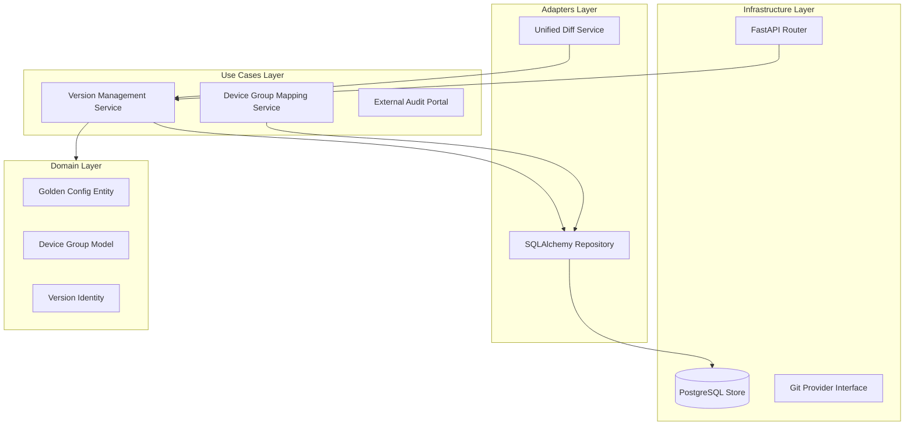

# Design Document: Golden Config Repository


## Overview


The Golden Config Repository is designed as a centralized, version-controlled 'Standard of Truth' for network configurations. The design philosophy centers on immutability and strict association logic; every configuration is treated as an immutable artifact linked to a specific version tag. This approach ensures that the 4,000-device fleet always has a verifiable baseline, and changes can be audited retrospectively without the risk of data loss. 

We utilize a Service-Oriented architecture within the application, separating the versioning logic from the hardware association logic. The 'Standard of Truth' is decoupled from device operational state, allowing architects to define 'how things should be' independently of 'how things are currently.' This distinction is critical for compliance auditing, as it provides a fixed reference point for differencing engines. 

The strategy employs an incremental migration of existing configuration data into the new repository. We maintain existing device group structures but introduce a new 'Association Layer' that binds these groups to specific Golden Config versions. This allows for a zero-downtime transition where devices are progressively brought under the management of the repository without disrupting existing management flows.


## Architecture





## Components and Interfaces


### 1. Config Repository Interface (`domain`)


**Path:** `src/domain/interfaces/config_repository.py`

| Responsibility | Description |
|---|---|
| Defining the contract for configuration persistence and retrieval | |
| Enforcing version immutability at the interface level | |
| Providing abstraction for fleet-wide configuration queries | |


```python
class IGoldenConfigRepository(Protocol):
    async def get_by_group(self, group_id: UUID, version: Optional[str] = None) -> GoldenConfig: ...
    async def save(self, config: GoldenConfig) -> VersionInfo: ...
    async def list_versions(self, group_id: UUID) -> List[VersionInfo]: ...
    async def get_diff(self, group_id: UUID, v1: str, v2: str) -> DiffResult: ...
```


### 2. Device Group Association Engine (`usecases`)


**Path:** `src/usecases/association_engine.py`

| Responsibility | Description |
|---|---|
| Mapping hardware roles to configuration templates | |
| Validating group-to-config scoping rules | |
| Resolving configuration inheritance for device hierarchy | |


```python
class AssociationService:
    def __init__(self, repo: IGoldenConfigRepository):
        self.repo = repo

    async def associate_config_to_group(self, group_id: UUID, config_id: UUID) -> bool:
        # Validates group existence and applies compliance scoping
        ...
    
    async def get_active_config_for_device(self, device_id: UUID) -> GoldenConfig:
        # Resolves group hierarchy to find the effective golden config
        ...
```


### 3. External Audit API (`infrastructure`)


**Path:** `src/infrastructure/api/v1/audit_routes.py`

| Responsibility | Description |
|---|---|
| Exposing configurations to external security tools | |
| Providing paginated access to version history | |
| Serializing domain entities for cross-system integration | |


```python
@router.get("/audit/configs/{group_id}")
async def get_audit_trail(
    group_id: UUID, 
    limit: int = 100, 
    offset: int = 0
) -> List[ConfigAuditSummary]:
    # Returns version history and diff links for external auditing
    ...
```


## Data Models


No new data models are introduced unless specified in the component descriptions above.


## Correctness Properties


*A property is a characteristic or behavior that should hold true across all valid executions of a system — essentially, a formal statement about what the system should do.*


### Property F1-P1: Version Immutability


*For any GoldenConfig C associated with DeviceGroup G, no update operation shall modify C directly; instead, a new GoldenConfig C' with an incremented version must be created.*

**Validates: Requirements 1.1, 3.2**


### Property F1-P2: Complete Association Coverage


*For any Device D in the fleet, D must be associated with exactly one effective GoldenConfig through its primary DeviceGroup.*

**Validates: Requirements 2.1, 4.1**


### Property F1-P3: Diff Consistency


*For any two versions V1 and V2 of a configuration for Group G, the DiffResult must be transitively consistent such that Diff(V1, V2) + Diff(V2, V3) results in the same logical state as Diff(V1, V3).*

**Validates: Requirements 3.1**


## Error Handling


| Scenario | Handling |
|---|---|
| Requesting a version diff for a non-existent version tag. | Return 404 Not Found with a JSON body explaining that the specific version or group does not exist. |
| Two operators attempt to update the Golden Config for the same Device Group simultaneously. | The Association Engine raises a 'GroupLockConflict' exception and the API returns 409 Conflict to prevent concurrent version updates. |
| Provisioning an invalid configuration template that violates hardware-specific syntax. | Return 400 Bad Request with a detailed schema validation error list. |


## Testing Strategy


The testing strategy focuses on maintaining the integrity of the 'Standard of Truth.' Regression testing will leverage the existing pytest suite with a new '@pytest.mark.compliance' tag to verify that existing device group lookups still function when redirected to the new repository. We will specifically test that 404 responses are correctly handled when a new group has not yet been assigned a config.

CI verification will run 'pre-commit' hooks for configuration schema validation and 'fastapi-test' modules for API endpoint reliability. For property-based testing, we will use the 'Hypothesis' library to generate 1,000+ random configuration versions and verify that the 'DiffEngine' always produces a valid transformation between any two arbitrary versions (testing 'Diff Consistency').

Testing configuration will involve a dedicated 'test_results' database schema using PostgreSQL to simulate fleet-scale data (4,000+ associations). Unit tests will target at least 90% coverage on the 'AssociationEngine' and 'VersioningSvc' modules, as these are critical for fleet stability.
