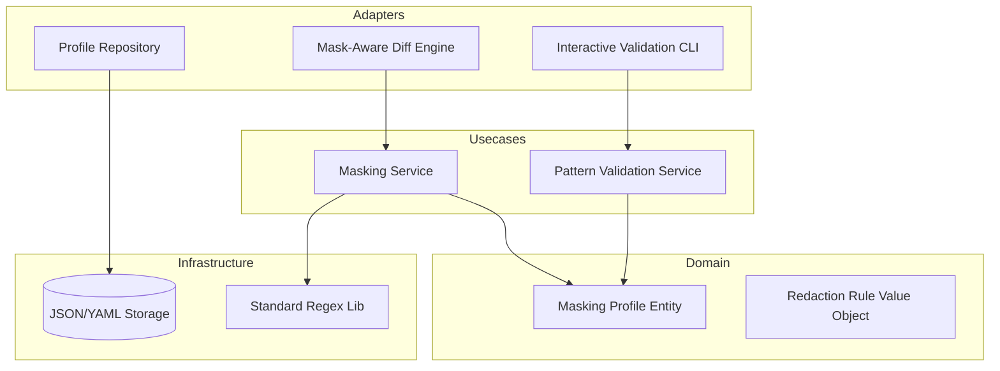

# Design Document: Regex Masking Profiles


## Overview


The Regex Masking Profiles feature is designed to decouple noise reduction logic from the core diffing engine using a 'Standardized Masking Layer'. The strategy involves introducing a middleware component that intercepts raw configuration data and applies OS-specific regex templates before the data reaches the drift detection logic. This maintains the integrity of the original data for troubleshooting while ensuring the audit logs only reflect significant, non-dynamic changes.

The architectural philosophy emphasizes 'Safe Redaction' through an interactive validation feedback loop. Instead of applying patterns blindly, the system requires patterns to be validated against sample data, reducing the risk of 'information blackout' where critical security settings are accidentally hidden. By leveraging OS-specific templates, we provide a 'Secure by Default' experience that handles common noise like timestamps and IPs right out of the box.


## Architecture





## Components and Interfaces


### 1. Masking Engine & Profile Domain (`domain`)


**Path:** `src/domain/masking_engine.py`

| Responsibility | Description |
|---|---|
| Define the structure of a Masking Profile and OS-specific templates | |
| Execute regex substitution logic safely | |
| Maintain separation between raw and masked data streams | |


```python
class RedactionRule(Protocol):
    pattern: str
    replacement: str = \"<MASKED>\"
    def apply(self, text: str) -> str: ...

class MaskingProfile:
    id: str
    os_type: str
    rules: List[RedactionRule]
    
    def mask(self, content: str) -> str:
        # Sequentially apply all regex rules
        ...
```


### 2. Interactive Validation Service (`usecases`)


**Path:** `src/usecases/validate_pattern.py`

| Responsibility | Description |
|---|---|
| Verify regex syntax and execution safety | |
| Calculate match spans for UI highlighting | |
| Provide heuristic warnings for broad patterns | |


```python
class ValidationResult:
    matches: List[Tuple[int, int]] # Start/End indices
    masked_content: str
    match_count: int

def preview_mask(sample_data: str, profile: MaskingProfile) -> ValidationResult:
    # Simulates masking and returns metadata for UI highlighting
    ...
```


### 3. Mask-Aware Diff Engine (`adapters`)


**Path:** `src/adapters/diff_engine.py`

| Responsibility | Description |
|---|---|
| Filter out non-critical drift based on masking profiles | |
| Support toggling between redacted and raw diff views | |
| Integrate with OS-specific templates during report generation | |


```python
class DiffReport:
    masked_diff: str
    original_diff: str
    has_masked_drift: bool # True if diff exists AFTER masking

def generate_report(source: str, target: str, profile: MaskingProfile) -> DiffReport:
    # 1. Mask both source and target
    # 2. Perform diff on masked versions
    # 3. Store original fragments for toggle view
    ...
```


## Data Models


No new data models are introduced unless specified in the component descriptions above.


## Correctness Properties


*A property is a characteristic or behavior that should hold true across all valid executions of a system — essentially, a formal statement about what the system should do.*


### Property F2-P1: Data Integrity Invariant


*For any input string S and Masking Profile P, the length of the masked output S' must be less than or equal to the length of S if the replacement string is empty, or predictable based on the replacement token length.*

**Validates: Requirements 2.0**


### Property F2-P2: Noise Reduction Correctness


*For any Masking Profile P, the set of 'significant' changes detected between configuration A and B is a subset of the changes detected without masking.*

**Validates: Requirements 1.0, 2.0**


### Property F2-P3: Validator Responsiveness and Safety


*For any regex pattern R provided by the user, the Interactive Validation Tool must return a SyntaxError or an execution match result within 500ms.*

**Validates: Requirements 3.0**


## Error Handling


| Scenario | Handling |
|---|---|
| User inputs invalid Regex syntax in the Validation Tool. | Catch Regex compilation error, return 'Invalid Pattern' message to UI with offending character index. |
| Masking requested for an OS type with no defined template. | Default to a 'No-Op' mask and log a warning; allow user to select a template manually. |
| Catastrophic Backtracking in a user-provided regex pattern. | Stop execution after 1 second (timeout) and flag the pattern as 'Inefficient/Dangerous'. |


## Testing Strategy


The testing strategy utilizes a mix of unit testing for regex logic and Property-Based Testing (PBT) for the diff engine. We will use the 'Hypothesis' library in Python to generate random strings and verify that masking never exposes data matched by a defined pattern.

Regression testing will involve running our existing library of 500+ configuration drift samples through the new engine with 'Empty Profiles' to ensure zero impact on legacy behavior. CI verification will run 'pytest --m 'masking_logic'' on every PR. New property-based tests will specifically target the 'Toggle' consistency: checking that switching from masked to unmasked views in the report doesn't change line-numbering or alignment. Configuration: 1000 iterations per PBT, tagged with 'F2-Audit-Trail'.
