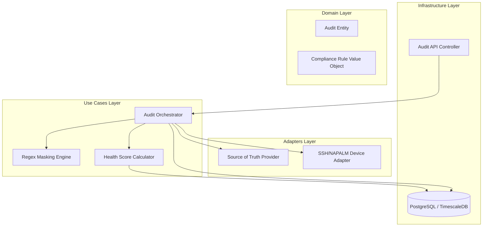

# Design Document: Fleet Drift Audit Service


## Overview


The Fleet Drift Audit Service is designed as a high-performance orchestration layer that bridges the gap between the intended network state (Source of Truth) and the actual running configurations of the fleet. The core strategy utilizes an asynchronous 'Audit Orchestrator' that manages parallel connections to devices, ensuring that 100% visibility is achieved without the linear scaling bottlenecks typical of legacy sequential audit scripts. This approach allows the system to satisfy the CISO's visibility requirements while maintaining operational speed.

A key philosophy of this design is 'Signal over Noise.' By introducing a Regex-Based Masking Engine, the service distinguishes between operational volatility (e.g., routing updates, timestamps) and actual configuration drift. This shift from raw diffing to intelligent comparison is critical for meeting the 95% false-positive reduction target. Furthermore, the introduction of a Fleet Health Score provides a single, actionable KPI for leadership, while maintaining deep-dive capabilities for operational auditors through a historical drift tracking database.

Architecturally, the service remains decoupled from specific hardware vendors by using an Adapter pattern for device communication. The existing SOT integration remains unchanged, while new Domain entities for 'Drift Events' and 'Audit Sessions' are introduced to support historical analysis and RCA. The system is built for 'safekeeping' the network; the Pre-Flight check ensures that no changes are made to already drifted devices, protecting legacy 'snowflakes' from further configuration instability.


## Architecture





## Components and Interfaces


### 1. Audit Orchestration Engine (`usecases`)


**Path:** `src/usecases/audit_orchestrator.py`

| Responsibility | Description |
|---|---|
| Executing parallel device audits via asyncio worker pools | |
| Enforcing 30-second SLAs for pre-flight compliance checks | |
| Aggregating raw diffs for the Masking Engine | |
| Persisting audit results for historical RCA (Root Cause Analysis) | |


```python
class IAuditOrchestrator(Protocol):
    async def run_fleet_audit(self, fleet_id: str) -> AuditSummary: ...
    async def verify_preflight(self, device_id: str) -> PreFlightResult: ...
    async def get_historical_drift(self, device_id: str, limit: int) -> List[DriftEvent]: ...
```


### 2. Regex Masking & Comparison Service (`domain`)


**Path:** `src/domain/masking_engine.py`

| Responsibility | Description |
|---|---|
| Normalizing configuration text via regex replacement | |
| Reducing noise from dynamic timestamps and counters | |
| Performing structural diffing of normalized configurations | |


```python
class MaskingEngine:
    def __init__(self, patterns: List[MaskingPattern]):
        self.patterns = patterns
    
    def apply_masks(self, raw_config: str) -> str:
        # Iteratively replace matches with [MASKED] to normalize text
        normalized = raw_config
        for p in self.patterns:
            normalized = re.sub(p.regex, "[MASKED]", normalized)
        return normalized
```


### 3. Fleet Health Scoring System (`usecases`)


**Path:** `src/usecases/health_scorer.py`

| Responsibility | Description |
|---|---|
| Calculating 100% visibility metrics for CISO reporting | |
| Weighting drift severity to produce the health percentage | |
| Providing time-series data for historical drift tracking | |


```python
def calculate_fleet_score(results: List[DeviceAuditResult]) -> float:
    # (Compliant / Total) * 100 adjusted by severity weights
    pass

def get_historical_trends(days: int) -> List[TimeSeriesPoint]:
    pass
```


### 4. Multi-Vendor Device Adapter (`adapters`)


**Path:** `src/adapters/device_adapter.py`

| Responsibility | Description |
|---|---|
| Connecting to legacy and modern network hardware via SSH/API | |
| Normalizing diverse output into plain-text configuration strings | |
| Managing connection timeouts and retry logic during bulk audits | |


```python
class DeviceAdapter(ABC):
    @abstractmethod
    async def fetch_running_config(self, host: str, sections: Optional[List[str]]) -> str: ...
    
    @abstractmethod
    async def check_connectivity(self, host: str) -> bool: ...
```


## Data Models


No new data models are introduced unless specified in the component descriptions above.


## Correctness Properties


*A property is a characteristic or behavior that should hold true across all valid executions of a system — essentially, a formal statement about what the system should do.*


### Property F3-P1: Pre-Flight Bound


*For any pre_flight_check(device), the execution time T must satisfy T < 30s.*

**Validates: Requirements 5**


### Property F3-P2: Masking Invariance


*For any configuration_diff(actual, intended), if actual contains a timestamp matching a registered MaskingPattern, the resulting DriftReport must contain 0 diffs for that line.*

**Validates: Requirements 2**


### Property F3-P3: Health Score Integrity


*For any fleet_health_score(fleet), the value S must be 0 <= S <= 100.0 and be derived from a total visibility of all reachable devices.*

**Validates: Requirements 1, 3**


## Error Handling


| Scenario | Handling |
|---|---|
| Device SSH Timeout during bulk audit | Record result as 'Unreachable' and exclude from compliance percentage (denominator) but include in 'Visibility' report. |
| Regex Masking Engine fails to parse malformed config section | Return 'Inconclusive' result with warning to user; do not mark as 'Drift Detected' to avoid false positives. |
| SOT (Netbox) API Unavailable during Pre-flight check | Fail-fast and inform operator that compliance cannot be verified; prevent config change. |


## Testing Strategy


The testing strategy follows a tiered approach focusing on high-concurrency reliability and masking accuracy. Regression testing will focus on existing SOT connectivity and basic device configuration fetching to ensure the new audit logic doesn't break standard configuration deployment workflows. We will use Pytest-asyncio to simulate bulk audits against virtualized network topologies (cisco_virl or containerlab).

CI verification will include a gate for the 30-second pre-flight requirement; any commit that increases the pre-flight check time for a 1000-line config beyond this threshold will fail the build. Property-based testing using Hypothesis will be used for the Masking Engine: we will generate strings containing random timestamps and routing updates formatted in vendor-specific styles to ensure the regex patterns consistently normalize them to a null diff.

Testing Configuration:
- Library: Pytest, Hypothesis, Toxic (for network latency simulation)
- Iterations: 500 property-based runs for the Masking Engine per PR.
- Tag Format: @audit-performance, @masking-accuracy, @historical-integrity.
