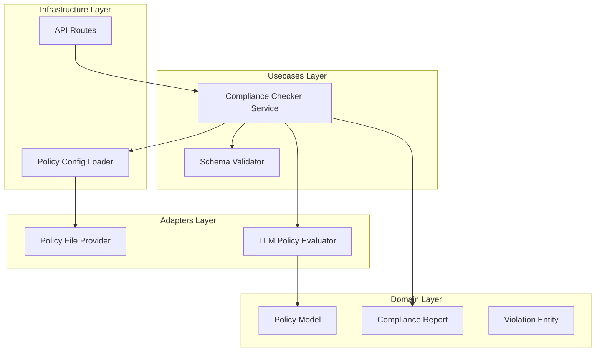

# Design Document: Pre-Flight Compliance Check


## Overview


The Pre-Flight Compliance Check (F4) is designed as a gatekeeper service that sits between the incoming request and the core processing engine. The design philosophy emphasizes 'Safety First,' ensuring that any ambiguity or failure in the compliance check results in a non-compliant status (Fail-Closed). We adopt a layered approach where semantic policy evaluation is decoupled from the specific LLM implementation, allowing for rapid iteration of compliance rules without modifying application code.

The incremental strategy involves first implementing the core domain models and a mock evaluator to establish the plumbing, followed by the integration of the LLM-based semantic evaluator. Existing request pipelines will remain unchanged until the compliance check is explicitly toggled on via middleware configuration, ensuring zero impact on current operations during the rollout phase.


## Architecture





## Components and Interfaces


### 1. Compliance Checker Service (`usecases`)


**Path:** `src/usecases/compliance_checker.py`

| Responsibility | Description |
|---|---|
| Orchestrate policy evaluation sequence | |
| Aggregate violations into a comprehensive report | |
| Determine overall pass/fail status based on policy severity | |


```python
class IComplianceChecker(Protocol):
    async def verify(self, payload: RequestPayload) -> ComplianceReport:
        ...

class ComplianceCheckerService:
    def __init__(self, policy_repo: IPolicyRepository, evaluator: IEvaluator):
        self.repo = policy_repo
        self.evaluator = evaluator
```


### 2. LLM Policy Evaluator (`adapters`)


**Path:** `src/adapters/llm_evaluator.py`

| Responsibility | Description |
|---|---|
| Context window management for large policies | |
| Prompt construction and LLM invocation | |
| Parsing LLM output into structured Violation entities | |


```python
class IEvaluator(Protocol):
    async def evaluate_rule(self, rule: PolicyRule, context: dict) -> List[Violation]:
        ...
```


### 3. Policy Domain Models (`domain`)


**Path:** `src/domain/policy.py`

| Responsibility | Description |
|---|---|
| Define the structure of compliance rules | |
| Represent the immutable results of a compliance check | |


```python
@dataclass(frozen=True)
class PolicyRule:
    id: str
    description: str
    severity: Severity # Enum: BLOCKER, WARNING, INFO

@dataclass(frozen=True)
class ComplianceReport:
    is_compliant: bool
    violations: List[Violation]
    timestamp: datetime
```


## Data Models


No new data models are introduced unless specified in the component descriptions above.


## Correctness Properties


*A property is a characteristic or behavior that should hold true across all valid executions of a system — essentially, a formal statement about what the system should do.*


### Property F4-P1: Blocker Invariant


*For any ComplianceReport R, R.is_compliant must be false if any Violation in R.violations has a severity of 'BLOCKER'.*

**Validates: Requirements F4.1**


### Property F4-P2: Policy Consistency


*For any compliance check execution, the system must use the exact version of policies defined in the active configuration at the moment of invocation.*

**Validates: Requirements F4.2**


## Error Handling


| Scenario | Handling |
|---|---|
| LLM Provider or API timeout during evaluation | The system defaults to 'FAIL' (is_compliant=False) and logs a critical system error to prevent unsafe bypass. |
| Policy configuration file is malformed or contains invalid logic tags | Validation error returned to caller identifying the malformed policy ID. |


## Testing Strategy


The testing strategy focuses on high-assurance verification using both traditional and property-based methods. 

Regression testing will involve running the existing test suite with the compliance middleware disabled to ensure no performance degradation or side effects occur. CI verification will utilize 'pytest' with a dedicated '--compliance' flag to trigger these intensive checks only when relevant files are modified.

New property-based tests using the 'Hypothesis' library will be introduced. These will generate a wide variety of malformed and edge-case request payloads to ensure the Compliance Checker never produces a 'Pass' status for a payload containing known blocker keywords. We will configure 100 iterations per test case to explore the LLM's non-deterministic boundaries. Configuration will be managed via a 'test_compliance_config.yaml' file to isolate test policies from production ones.
