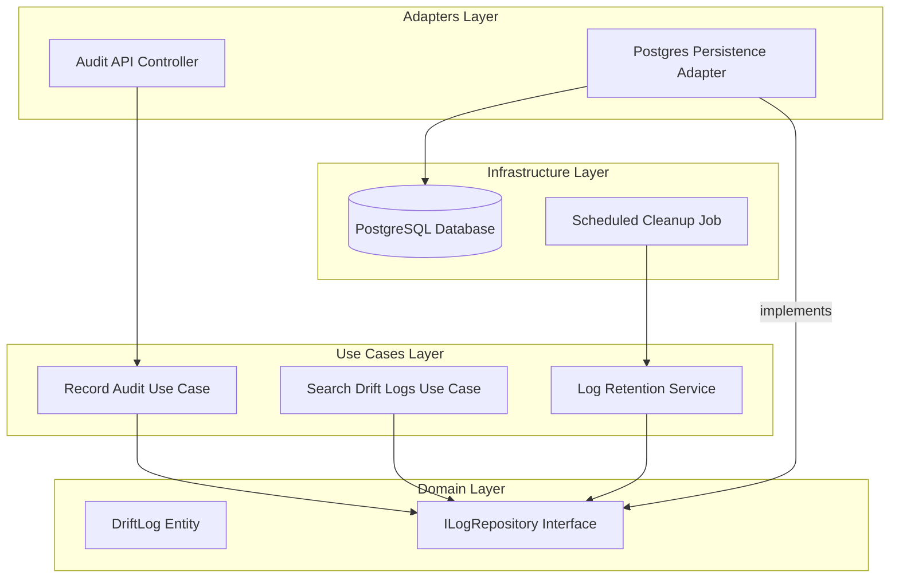

# Design Document: Historical Drift Logs

## Overview

The Historical Drift Logs feature transition the system from a 'current-state only' view to a full temporal audit trail. Our strategy leverages a unified persistence layer where both manual pre-flight checks and automated scheduled audits are treated as identical 'DriftLog' entities. This ensures a consistent timeline for forensic analysis while satisfying regulatory compliance requirements for immutable record keeping.

Architecturally, we introduce a Repository pattern in the Domain layer to abstract the storage mechanism. This allows us to start with a relational database (Postgres) for its robust indexing and query capabilities—essential for searching by device and date—while keeping the door open for cold-storage archival in the future. We are not changing how audits are calculated; instead, we are intercepting the output of existing audit engines to feed the new persistence pipe.

The design philosophy emphasizes 'Automated Lifecycle Management'. By incorporating a dedicated Retention Service within the Use Case layer, we ensure that performance does not degrade as log volume increases. This service will run as a decoupled background task, adhering to the principle of separation of concerns where the primary audit path is never blocked by maintenance operations.

## Architecture

## Data Models

No new data models are introduced unless specified in the component descriptions above.

## Testing Strategy

The testing strategy focuses on the reliability of the persistence pipe and the accuracy of the timeline retrieval. 

Regression Testing: Existing audit tests will be wrapped with assertions to verify that for every audit run, a database entry is also created. We will use the existing pytest suite with a temporary Postgres container (testcontainers).

CI Verification: 
- `pytest tests/integration/test_log_persistence.py` 
- `pytest tests/unit/usecases/test_retention_policy.py`

Property-Based Testing: Using the Hypothesis library, we will generate sequences of audits with randomized timestamps and device IDs. 
- Property 1: 'Timeline Consistency'—Given a set of generated logs, searching for a specific timeframe must always return the subset of logs where 'start <= timestamp <= end'. 
- Property 2: 'Retention Invariant'—After running the retention service, no logs with a timestamp older than the cutoff may remain in the database. 
Iterations: 200 per property. 
Tag Format: @f5_drift_history.
