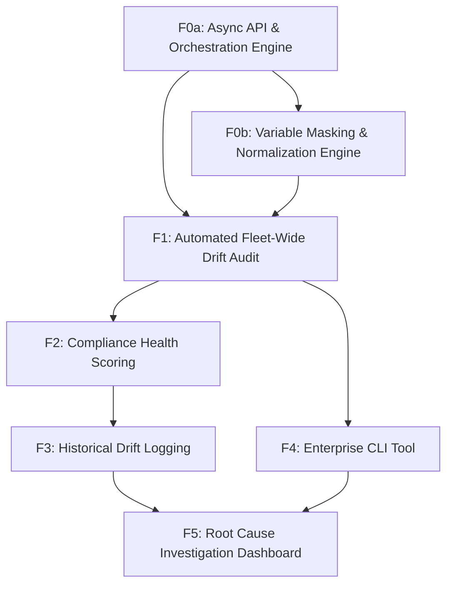

# Feature Map

## Features

| ID | Name | Type | Size | Dependencies |
|----|------|------|------|--------------|
| F0a | Async API & Orchestration Engine | foundation | medium | — |
| F0b | Variable Masking & Normalization Engine | foundation | large | F0a |
| F1 | Automated Fleet-Wide Drift Audit | product | large | F0a, F0b |
| F2 | Compliance Health Scoring | product | medium | F1 |
| F3 | Historical Drift Logging | product | medium | F2 |
| F4 | Enterprise CLI Tool | product | small | F1 |
| F5 | Root Cause Investigation Dashboard | product | medium | F3, F4 |

## Milestones

### M0: Foundations & Ingestion Engine

**Goal:** Build the core engine for high-scale config ingestion and masking.

**Exit Criteria:**
- Ability to pull raw config from 100+ simulated devices simultaneously
- Regex parser successfully ignores system-generated timestamps in flat files

**Features:** F0a, F0b

### M1: Drift Detection Core

**Goal:** Deliver core drift detection and health scoring capabilities.

**Exit Criteria:**
- Visual side-by-side diffing of masked configs in <30 seconds
- API returns compliance health score for a fleet of devices

**Features:** F1, F2

### M2: Enterprise Readiness & Auditing

**Goal:** Enable enterprise-grade auditing, history, and CLI workflows.

**Exit Criteria:**
- Persistence of drift events for 30+ days in audit log
- CLI tool triggers fleet audit via API endpoint

**Features:** F3, F4, F5

## Dependency Graph

