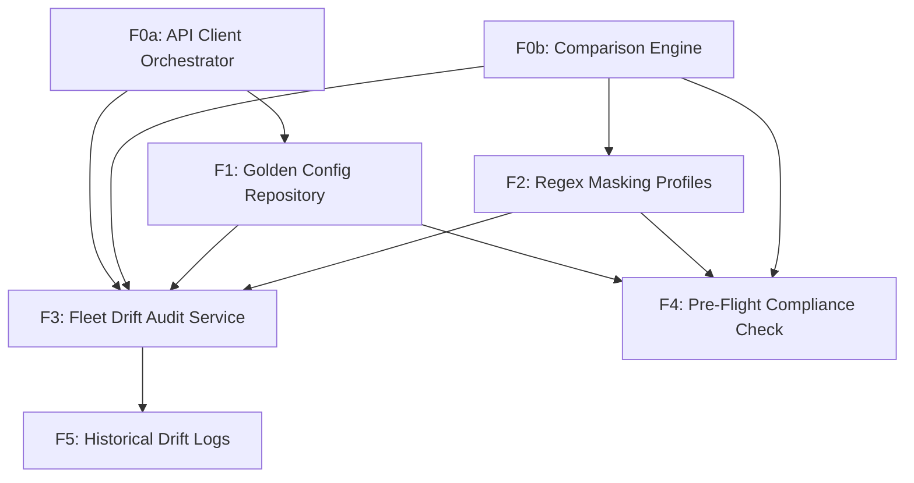

# Feature Map

## Features

| ID | Name | Type | Size | Dependencies |
|----|------|------|------|--------------|
| F0a | API Client Orchestrator | foundation | medium | — |
| F0b | Comparison Engine | foundation | medium | — |
| F1 | Golden Config Repository | product | medium | F0a |
| F2 | Regex Masking Profiles | product | large | F0b |
| F3 | Fleet Drift Audit Service | product | large | F0a, F0b, F1, F2 |
| F4 | Pre-Flight Compliance Check | product | medium | F1, F2, F0b |
| F5 | Historical Drift Logs | product | small | F3 |

## Milestones

### M0: Foundations & Core Engine

**Goal:** Establish the core connectivity and comparison infrastructure.

**Exit Criteria:**
- Successful retrieval of config via API client using FastAPI endpoints.
- Verification of diff engine accurately identifying a 1-line change between two strings.

**Features:** F0a, F0b

### M1: MVP Compliance Auditing

**Goal:** Enable automated fleet-wide auditing with noise reduction.

**Exit Criteria:**
- Ability to mask dynamic timestamps in a config and return a clean match.
- Generation of a delta report across multiple test devices.

**Features:** F1, F2, F3

### M2: Operational Excellence & History

**Goal:** Delivery of real-time operator tools and audit trail visibility.

**Exit Criteria:**
- Pre-flight check returns diff in under 30 seconds.
- Historical logs persisted and searchable by date/device.

**Features:** F4, F5

## Dependency Graph

